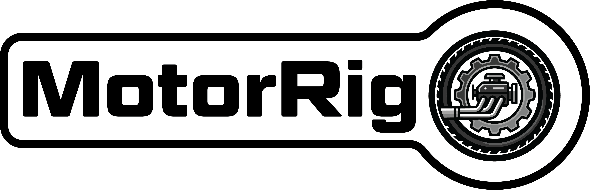
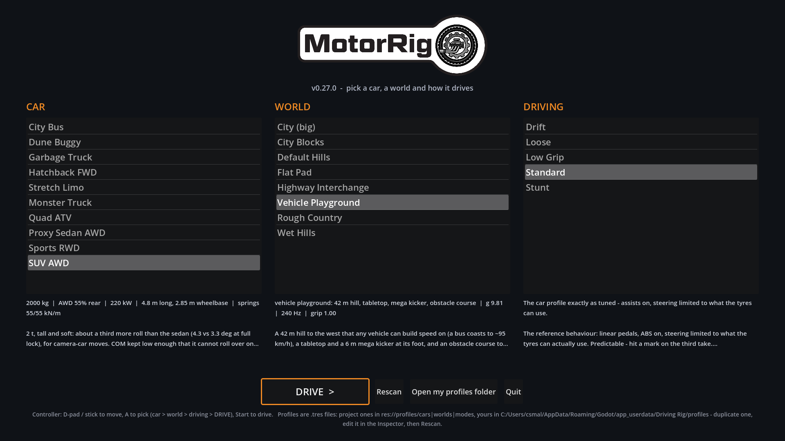
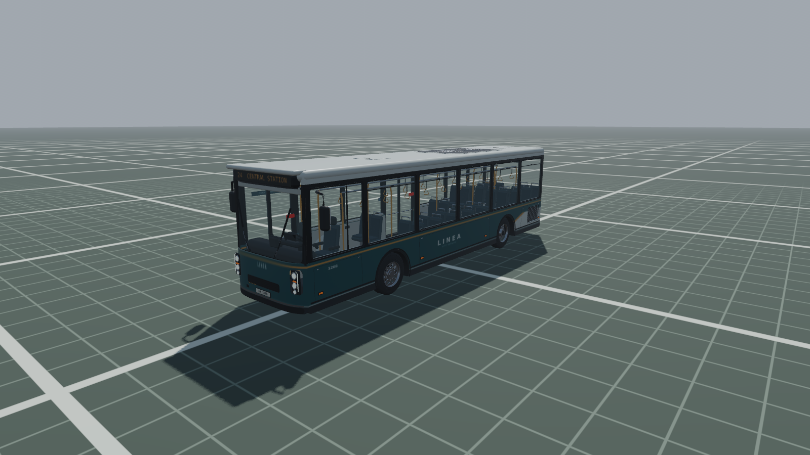
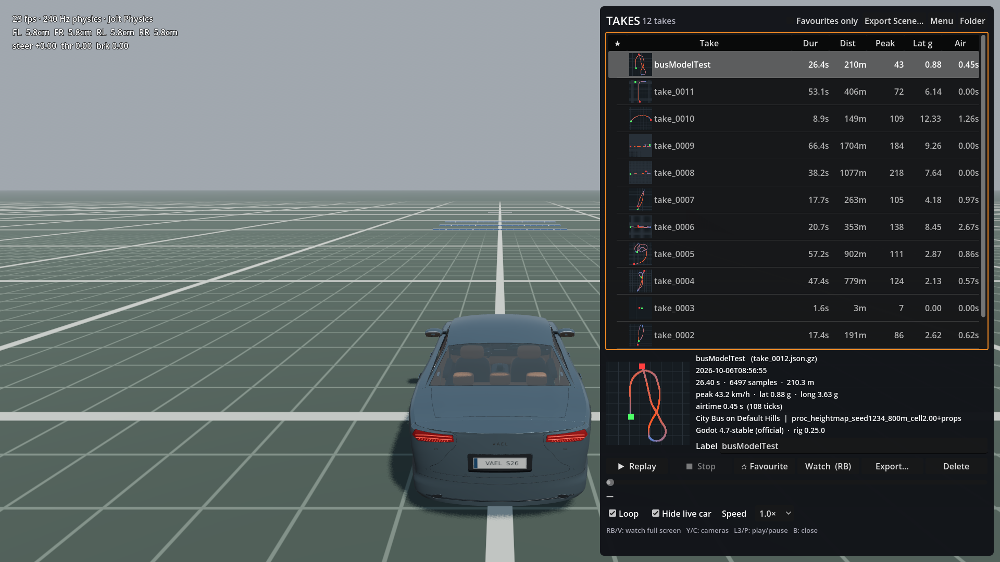
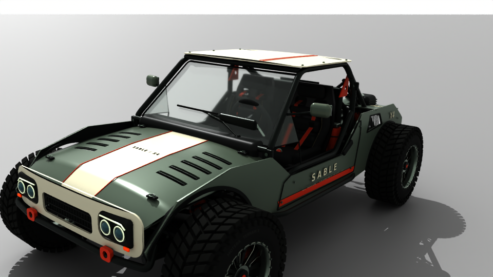

<p align="center">
  
</p>

<p align="center">
  <b>Drive a car with a gamepad, record the take, and put it in Maya - animated, on the real car model, ready for Arnold.</b>
</p>

---

MotorRig is a DIY car-rig for previs and animation: a do-it-yourself replacement for tools like
Craft Director. You drive ten vehicles - sedan, hatchback, sports car, SUV, limo, city bus, garbage
truck, monster truck, dune buggy, quad - around a set of worlds in **Godot 4.7** with an Xbox-style
controller (or keyboard). Every drive can be recorded as a **take**: the car body, every wheel's
steer, suspension and spin, the steering wheel, contact points and slip, and all 26 cameras, at
240 Hz. In **Maya**, a take becomes a keyed rig in one import, and one more click puts the game's
full textured car model on it with **Arnold** shaders.

<p align="center">
  
  
</p>
<p align="center">
  
  
</p>

**Contents**

1. [What you need](#1-what-you-need)
2. [Getting started](#2-getting-started)
3. [Using MotorRig](#3-using-motorrig) - the menu, driving, controls, cameras, recording, the take browser
4. [Exporting a standalone build](#4-exporting-a-standalone-build)
5. [Installing the Maya tools](#5-installing-the-maya-tools)
6. [The Maya tools](#6-the-maya-tools) - importing takes, the car model, scene geometry, spin, skids
7. [A typical shot, start to finish](#7-a-typical-shot-start-to-finish)
8. [Troubleshooting](#8-troubleshooting)
9. [Where things are](#9-where-things-are)

The full technical reference - tuning, every profile, the physics, the take format, the test
suite - is in [`driving_rig/README.md`](driving_rig/README.md), with the take format itself in
[`driving_rig/docs/SCHEMA.md`](driving_rig/docs/SCHEMA.md).

---

## 1. What you need

| | |
|---|---|
| **Godot 4.7** (standard build, not .NET) | [godotengine.org/download](https://godotengine.org/download). Forward+ renderer. |
| **A controller** (recommended) | Any Xbox-layout gamepad. Everything also works on a keyboard. |
| **Maya** | For the Maya side. Tested in Maya 2025 and 2027. The car-model loader uses numpy, which those versions ship with; the rest of the tools need nothing extra. |
| **Arnold (MtoA)** | For the car models' shaders (installed with Maya by default). Without it the cars still load, textured, with Maya's standardSurface instead. Tested with MtoA 5.6.2. |
| **Git LFS** | Not needed. Every file is under GitHub's 100 MB limit. |

Disk: the repository is about 1 GB, mostly the ten car models and their textures. Godot's
import cache adds about the same again on first open.

## 2. Getting started

1. **Clone or download** the repository:
   ```bash
   git clone https://github.com/csmallfield/MotorRig.git
   ```
2. **Open the project:** start Godot, choose *Import*, and pick `driving_rig/project.godot`.
3. **Wait for the first import.** Godot converts the car models and their textures the first
   time; it takes a few minutes and only happens once.
4. **Press F5** (or the Play button). The start menu opens.

## 3. Using MotorRig

### The start menu

Pick three things, then drive:

- **Car** - one of the ten vehicles. Its weight, power, size and a description are shown below the list.
- **World** - where you drive: hills, a flat pad, rough country, wet roads, two New York-style
  cities, a highway interchange, and a playground with a big hill, jumps and an obstacle course.
- **Driving** - how the car responds. **Standard** is the car as tuned. **Loose**, **Drift**,
  **Low Grip** and **Stunt** change the handling for different kinds of shot (the menu warns you
  when the handling no longer matches the car's tested numbers).

**On a controller:** the D-pad or left stick moves; **A** picks and moves on (car > world >
driving > DRIVE); **Start** drives from anywhere. With a mouse, click the items and *DRIVE*.
Your last choice is remembered.

*Rescan* re-reads the profiles after you add or edit one; *Open my profiles folder* opens the
folder where your own profiles go (see [Where things are](#9-where-things-are)).

A loading screen shows while the car and world load; the biggest cars take a couple of seconds.

### Driving controls

| Controller | Keyboard | |
|---|---|---|
| RT / LT | W / S (or Up / Down) | throttle / brake |
| Left stick | A / D (or Left / Right) | steer |
| B | Space | handbrake |
| X | X | reverse gear - only at a standstill; LT is only ever the brake |
| Y | C | next camera in the current bank (1-9 jump to one) |
| D-pad left / right | Z / B | previous camera / switch camera bank |
| D-pad up | F2 | next start point (worlds that have several) |
| D-pad down | F1 | show / hide the help overlay |
| Start | R | record / stop |
| View (Back) | Backspace | recover: put the car back on its wheels where it is |
| R3 (click right stick) | Home | reset to the start point |
| LB | Tab | open / close the take browser |
| RB | V | watch the loaded take full screen |
| L3 (click left stick) | P | play / pause the replay ghost |
| LB, then *Menu* | Esc | back to the start menu |
| | O | open the takes folder |

Recover and reset are disabled while recording, so every take is one continuous piece of driving.

### Cameras

There are 26 cameras in two banks, and every one of them runs and is recorded all the time - so
switching never jumps, and in Maya you get every angle, not just the one you were looking at.

- **Broadcast bank** (14) - the car always held in frame: chase, driver's eye, heli, a tracking
  car ahead, side-on arm, wheel and bumper mounts, a trackside camera that pans as you pass,
  orbit, crane, drone, low chase, a locked-off pan, and a rear-wheel mount.
- **Wild bank** (12) - deliberately rougher: handheld, overtake, head-on kamikaze, a dolly-zoom,
  a camera on the road in your path, one that loses you, whip pans, crash zooms, a ground skimmer,
  a cable cam, and fisheye mounts front and back.

**Y** steps through the current bank, **D-pad right** switches bank, **D-pad left** goes back one.
On a keyboard, number keys jump straight to a camera. Camera distances scale with the size and
top speed of the vehicle, so the bus and the quad are both framed sensibly.

### Recording a take

1. Press **Start**. A 3-2-1 countdown runs, then recording begins (a red *REC* timer shows).
2. Drive the shot.
3. Press **Start** again. Recording carries on for a few frames of handle, then the take is saved.

Takes are saved as `take_0001.json.gz`, `take_0002.json.gz`, and so on, in your takes folder
(`%APPDATA%\Godot\app_userdata\Driving Rig\takes\` on Windows - press **O** to open it). Each has
a top-down thumbnail of the path. If you play with sound, what you heard is saved next to it as
a `.wav`, and Maya puts it on the timeline in sync.

### The take browser

Press **LB** (Tab) to open it. The car parks and the camera follows the replay.

- **The list** shows every take with its length, distance, top speed, lateral g and airtime.
  It opens on the newest one.
- **Replay** (A on a take) plays it back as a ghost car - rebuilt from the take alone, exactly as
  Maya will see it. **Y** switches between the chase camera and the camera the take was shot with;
  the slider scrubs.
- **Watch (RB)** hides the panel and plays the take full screen with all 26 live cameras plus the
  take's own recorded ones to cycle through - watch it as you shot it, or from anywhere else.
- **Favourite**, and a **Label** to give a take a readable name (the file name never changes, so
  nothing that already points at it breaks). *Favourites only* filters the list.
- **Export...** saves a copy of the take anywhere you like (and checks it). This is the file you
  give to Maya.
- **Export Scene...** saves the world itself - ground, props, road markings - as OBJ files in the
  same space as the takes, so the car drives on the right ground in Maya.
- **Delete** moves a take and its thumbnail to the recycle bin (the confirm defaults to Cancel).
- **Menu** (top row) goes back to the start menu.

**On a controller:** the D-pad moves between rows and along them, **A** presses, **B** closes the
browser. Close it with a ghost still playing and the ghost keeps looping while you drive - handy
for re-shooting a take against the last one. Typing a label needs a keyboard; the export and
folder buttons open normal file dialogs, meant for the mouse.

### Your own cars, worlds and driving modes

Everything that defines a car, a world or a driving mode is a small `.tres` profile. To make your
own, duplicate one in Godot's FileSystem dock (`profiles/cars`, `profiles/worlds`,
`profiles/modes`), double-click it, change it in the Inspector, save, and press *Rescan* in the
menu. Profiles you keep outside the project go in your profiles folder (*Open my profiles folder*).
Every setting is described in [`driving_rig/README.md`](driving_rig/README.md#profiles-tuning).

## 4. Exporting a standalone build

You can turn MotorRig into a normal Windows program that runs without Godot - for a machine on set,
or for someone who only needs to drive and record.

> These steps follow Godot 4.7's standard export. The project has not yet been test-exported with
> the 4.7 templates; if anything differs, the Godot docs on
> [exporting projects](https://docs.godotengine.org/en/stable/tutorials/export/exporting_projects.html)
> are the reference.

1. **Install the export templates (once).** In Godot: *Editor > Manage Export Templates >
   Download and Install*. They must match your Godot version exactly (4.7).
2. **Add a Windows preset.** *Project > Export... > Add... > Windows Desktop*.
3. **Leave out what the program doesn't need.** On the preset's *Resources* tab, in
   *Filters to exclude files/folders*, enter:
   ```
   tests/*, tools/*, docs/*, graphic_elements/PNG/*
   ```
   (The Maya tools and their cache are skipped automatically: the `maya` folder carries a
   `.gdignore`, so Godot never imports it.)
   Leave *Export Mode* on **Export all resources in the project** (the default): car profiles
   name their models by path, so the exporter can't discover them on its own.
4. **Export.** Click *Export Project...*, choose a folder and a name such as `MotorRig.exe`, and
   leave *Export With Debug* off for a normal build. Godot writes the `.exe` and a `.pck` beside it
   (or tick *Embed PCK* on the preset for a single file). Keep them together.
5. **Run it.** Copy the folder anywhere and double-click the `.exe`.

**What changes in a built program:**

- Takes, labels and settings go to the same place as in the editor:
  `%APPDATA%\Godot\app_userdata\Driving Rig\` (`takes\`, `profiles\`, `settings.cfg`).
- The profiles inside the program can't be edited. To add or change a car, world or driving
  mode, put a `.tres` in `%APPDATA%\Godot\app_userdata\Driving Rig\profiles\cars\` (or `worlds\`,
  `modes\`) - the menu lists them as yours.
- Sounds can be added the same way, in `%APPDATA%\Godot\app_userdata\Driving Rig\audio\`.

## 5. Installing the Maya tools

1. **Get the repository onto the machine running Maya** (the Maya tools live in
   `driving_rig/maya/`, and the car loader reads the models from `driving_rig/models/`, so keep the
   whole `driving_rig` folder together).
2. **Open Maya** and **drag `driving_rig/maya/install_driving_rig.py` from Explorer into a
   viewport.**
3. A confirmation appears. You now have a **Driving Rig** menu in the main menu bar and a
   **DrivingRig** shelf (*Import*, *Scene*, *Solve*).

The installer adds a small, clearly marked block to your `userSetup.py`, so the menu comes back
every time Maya starts. Nothing else on your system changes and there is nothing to pip-install.

- **Updating:** after pulling a new version, drag the installer in again. It reloads the tools
  without restarting Maya.
- **Uninstalling:** *Driving Rig > Uninstall...* removes the menu, the shelf and the
  `userSetup.py` block.
- **Arnold:** the car loader builds Arnold shaders whenever Arnold (MtoA) is installed - it loads
  the plug-in itself. To render, have *mtoa* loaded as usual (*Windows > Settings/Preferences >
  Plug-in Manager*).

## 6. The Maya tools

Everything is in the **Driving Rig** menu. Most tools work on "the selected rig" - select any
part of an imported take (or nothing, if there's only one in the scene).

### Import Take...

*Driving Rig > Import Take...* (or the *Import* shelf button). Pick a take - one exported from the
take browser, or straight from your takes folder.

| Option | What it does |
|---|---|
| **Name** | The namespace the take lives in (`drv_<name>:`). Defaults to the file name. |
| **Frame rate** | 23.976 - 60 fps. The take is resampled to it. Default 24. |
| **IN frame** | The frame the take's first recorded frame lands on. Default 1001. |
| **World scale** | Scene scale for everything MotorRig imports: 1.0 = real size in centimetres, 0.1 = one unit per 10 cm. Change it any time (see *World Scale...*). |
| **Set scene frame rate** | Switch the scene to the take's frame rate. |
| **Set playback range** | Set the time slider to the take, including its handles. |
| **Import the take's camera** | `take_cam`: the camera you were looking through, switching as you switched. |
| **Import every recorded camera** | All 26 cameras as `cam_*`, plus a stepped `activeCamera` channel on the root saying which one was live - ready for a camera sequencer. |
| **Steering wheel** | The animated steering wheel. |
| **Contact locators** | One per wheel at the tyre's contact point, with `grounded`, `slipLong` and `slipLat` channels - triggers for dust, smoke and skid FX. |
| **Solve wheel spin from travel** | Rebuild wheel spin from how far each wheel actually travels in Maya (recommended). Off: use the spin as recorded. |

Your choices are remembered. After import, a report shows the take's length and checks the wheel
spin. Each take is a self-contained rig:

```
drv_<name>:root                 move / rotate the whole take from here
  chassis                       the car body - translate + rotate, rotate order zxy
    wheel_FL_steer > wheel_FL_susp > wheel_FL_spin > wheel_FL_geo     (x4: FL FR RL RR)
    steering_column > steering_wheel
  contacts/contact_FL ...       contact points + FX channels
  cameras/cam_chase ...         every recorded camera
  take_cam                      the camera you drove with
```

Several takes can share a scene. Keys are written one per frame, and heading accumulates past
360 degrees without flips, so the curves are clean to edit.

### Car Model > Load Car Model for Take

The quickest way to a finished-looking shot. Select the take rig and choose
*Driving Rig > Car Model > Load Car Model for Take*. MotorRig works out which car the take was
driven with, then loads the game's full model of it - body, cabin, glass, every wheel, brake
calipers and the steering wheel - attached to the rig, with Arnold shaders.

- **The first time** you load a particular car, it is converted and cached in
  `driving_rig/maya/cars/<car>/` (15-30 seconds, in the background - your scene isn't touched, and
  there's a progress window you can cancel). After that it loads straight away. The cache rebuilds
  itself if the car model changes.
- **It is referenced, not imported**, so shot files stay small and an updated car model reaches
  every shot that uses it. Each take gets its own copy (`drv_<name>_car:`).
- **Nothing to line up.** The models are built on the rig's own resting pose, so they fit exactly.
  Wheels spin, steer and travel with the rig; calipers steer and travel but don't spin; the
  steering wheel turns.
- **Shaders:** each material becomes an `aiStandardSurface` with its colour, roughness, metalness
  and normal maps, clearcoat on the paint, glowing lamps and screens, and real transmissive glass.
  The textures are read from `driving_rig/models/vehicles/<car>/`; Arnold writes its `.tx` copies
  there too.
- **Unload Car Model** removes it again. *Delete Rig* also removes it.

### Car Model > your own model

To put your own model on a take instead:

1. **Create Bind Car** (with the take rig selected) - a still copy of the car at rest, sitting on
   its tyres, wheels straight. It shows in reference mode so you can snap to it.
2. Line your model up with it, organised into groups named `chassis`, `wheel_FL`, `wheel_FR`,
   `wheel_RL`, `wheel_RR` and optionally `steering_wheel`. For parts that steer and travel but
   shouldn't spin (calipers), use `wheel_FL_susp` etc.; for parts that only steer, `wheel_FL_steer`.
   **Create Model Groups** makes the empty, correctly placed groups for you. Case, namespaces and a
   `_grp` / `_geo` suffix don't matter.
3. Select your model's top group and the rig, then **Attach Model**. Each group follows its part
   of the rig; your model stays in its own place in the outliner, and the proxy boxes hide.

**Detach Model** puts everything back exactly where you placed it. **Toggle Proxy Geometry** shows
or hides the rig's stand-in boxes and cylinders.

### Import Scene Geo...

*Driving Rig > Import Scene Geo...* (or the *Scene* shelf button). Pick the `scene.json` inside a
folder written by the take browser's *Export Scene...*. You get the world's ground and props in
exactly the space the takes use, so the wheels sit on the ground with no offset. Road markings
are tagged `drvCollides = False`. If a take and a scene came from different ground, the import
report warns you - that mismatch is what floating or sunken wheels look like.

### Re-solve Spin and Check Spin

- **Re-solve Spin** (or the *Solve* shelf button) - after you retime the take, offset it, or
  change its path, run this to rebuild the wheel spin from how far the wheels really move in the
  scene. Skids, wheelspin and airborne spin from the take are kept. Retime the whole rig (not
  only the body) for exact results.
- **Check Spin** - measures each wheel's effective radius against the take and warns if it's off
  by more than 1.5 %, the sign of a scale or setup problem.

### Create Skid Curves

Turns every stretch where the tyres were sliding into a NURBS curve under `<take>:skids`, each
with its wheel, start and end frames, peak slip, length, and a keyed `drvIntensity` (0 > slip > 0)
to drive smoke or emitters. Lower the threshold to catch gentler slides.

### World Scale..., Select Rig Root, Delete Rig / Scene...

- **World Scale...** - everything MotorRig imports sits under one group, `DrivingRig_world`, with
  a single `worldScale` channel (1.0 = real size in cm; 0.1 = one unit per 10 cm). Set it here or
  in the channel box at any time; spin solving and checks keep working at any scale.
- **Select Rig Root** - selects the root of the rig you're working on.
- **Delete Rig / Scene...** - removes a take or an imported scene and everything in its namespace.
  A model you attached yourself is detached first and never deleted; a loaded car model is unloaded.

Import isn't undoable as one step (the keys are written directly, for speed) - use *Delete Rig*
to take one out.

## 7. A typical shot, start to finish

1. In Godot, pick the car, world and driving mode, and press **Start** on the controller.
2. Find your line. Press **Start**, drive the shot, press **Start** again.
3. **LB** opens the take browser; **RB** watches it back from any camera. Re-shoot until it's right
   (closing the browser with the ghost playing lets you drive against your last attempt).
4. Give the keeper a label, **Export...** it, and if the ground matters, **Export Scene...** too.
5. In Maya: *Import Scene Geo...* (if you exported the scene), then *Import Take...*.
6. Select the rig, *Car Model > Load Car Model for Take*.
7. Look through `take_cam` or any `cam_*`, render in Arnold. If you retime or move the take,
   *Re-solve Spin*.

## 8. Troubleshooting

| Problem | What to do |
|---|---|
| **The menu takes a while the very first time** | Godot is importing the car models and textures. It only happens once. |
| **A car loads slowly** | The full models are large (up to 1.8 million triangles). A loading screen shows while they load. |
| **Wheels float or sink in Maya** | The take and the scene came from different worlds - the import report says so. Export the scene from the same world you drove. |
| **Wheel spin looks wrong after retiming** | *Driving Rig > Re-solve Spin*, then *Check Spin*. |
| **No Driving Rig menu in Maya** | Drag `install_driving_rig.py` into a viewport again. |
| **"Building the car model failed"** | The message names a `build.log` in `driving_rig/maya/cars/<car>/`. Delete that car's folder to force a clean rebuild. |
| **Car model has standardSurface instead of Arnold shaders** | Arnold (MtoA) wasn't installed when that car was first built. Install it, delete `driving_rig/maya/cars/<car>/`, and load the car again. |
| **The controller does nothing in a menu** | Make sure it's connected before the program starts; Godot picks up controllers at launch and when plugged in. |

## 9. Where things are

| | |
|---|---|
| `driving_rig/project.godot` | open this in Godot |
| `driving_rig/profiles/` | the cars, worlds and driving modes that ship with MotorRig |
| `driving_rig/models/vehicles/<car>/` | each car's model and textures |
| `driving_rig/maya/install_driving_rig.py` | drag into Maya to install the tools |
| `driving_rig/maya/cars/` | the Maya car-model cache (created on use, not in git) |
| `driving_rig/tools/` | helper scripts (proxy-body builder, texture stripper) |
| `driving_rig/docs/SCHEMA.md` | the take file format |
| `%APPDATA%\Godot\app_userdata\Driving Rig\takes\` | your takes |
| `%APPDATA%\Godot\app_userdata\Driving Rig\profiles\` | your own cars, worlds and driving modes |

**Running the tests** (after changing anything):

```bash
godot --headless --path driving_rig --fixed-fps 240 --script res://tests/run_tests.gd
```

```bash
"<your Maya folder>\bin\mayapy.exe" -m unittest discover -s driving_rig/maya/tests
```

On Windows, use Godot's *console* executable for the first one, e.g.
`Godot_v4.7-stable_win64_console.exe`.
